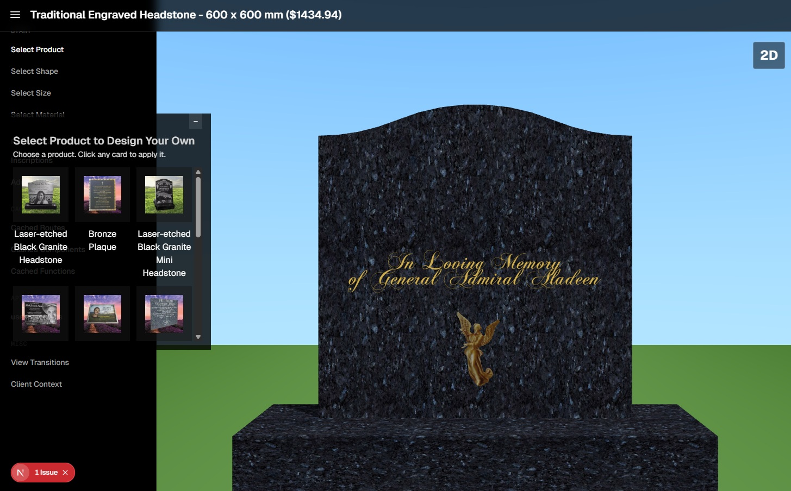

# DYO - Design Your Own Headstone

**Design & Buy Headstones Online - A Step-by-Step Guide for Families**

An interactive 3D web application that allows families to design custom memorial headstones online with real-time visualization, material selection, laser etching, and personalized inscriptions.

**Live Demo**: [https://forevershining.org//](https://forevershining.org/)



## Overview

DYO (Design Your Own) is a comprehensive online headstone design platform that guides families through the complete customization process. From selecting shapes and materials to adding laser-etched photos and inscriptions, the application provides an intuitive, visual experience with instant 3D rendering.

## Key Features

### 🎨 **Interactive 3D Design Studio**
- Real-time 3D visualization using Three.js and React Three Fiber
- 2D and 3D camera modes for detailed viewing
- Smooth animations and transitions between design stages
- WebGL-based rendering with optimized performance

### 📐 **Comprehensive Customization**

**Shapes & Styles**
- Wide range of headstone shapes (Serpentine, Ogee, Gothic, and more)
- Support for custom shapes upon request
- SVG-based shape system for precision

**Materials**
- 30+ premium granite and stone materials
- High-quality textures including:
  - Imperial Red
  - Blue Pearl
  - Emerald Pearl
  - White Carrara
  - Chinese Calca
  - And many more

**Size Selection**
- Dimensions: 300mm to 1200mm (width & height)
- 1mm precision increments
- Automatic thickness calculation based on dimensions
- Cemetery regulation compliance guidance

**Inscriptions**
- Multiple font options (10+ professional fonts)
- 34+ color choices including gold and silver gilding
- Custom text placement and rotation
- Font size control (5mm - 1200mm)
- Real-time preview

**Additions & Embellishments**
- 3D decorative applications (angels, crosses, religious figures)
- Vases and statues
- Laser-etched images and motifs
- Position, scale, and rotation controls

## Technology Stack

### Frontend
- **Framework**: Next.js 15.5.2 (App Router)
- **React**: 19.1.1
- **3D Graphics**: 
  - Three.js 0.180.0
  - React Three Fiber 9.3.0
  - React Three Drei 10.7.4
- **Styling**: Tailwind CSS 4.1.13
- **State Management**: Zustand 5.0.8
- **UI Components**: Flowbite 3.1.2, Heroicons
- **Animations**: use-count-up for dynamic counters

### Development
- **TypeScript**: 5.9.2
- **Build Tool**: Next.js with Turbopack
- **Package Manager**: pnpm
- **Code Formatting**: Prettier with Tailwind plugin

### Content & Validation
- **MDX Support**: @next/mdx for documentation pages
- **Validation**: Zod 4.1.5
- **Date Handling**: date-fns 4.1.0
- **Pricing**: dinero.js for currency calculations

## Getting Started

### Prerequisites
- Node.js 18+ 
- pnpm (recommended) or npm

### Installation

1. Clone the repository:
```sh
git clone https://github.com/yourusername/next-dyo.git
cd next-dyo
```

2. Install dependencies:
```sh
pnpm install
```

3. Create environment file:
```sh
cp .env.local.example .env.local
```

4. Start the development server:
```sh
pnpm dev
```

5. Open your browser:
```
http://localhost:3000
```

### Production Build

```sh
pnpm build
pnpm start
```

## Project Structure

```
next-dyo/
├── app/                          # Next.js App Router pages
│   ├── additions/               # 3D additions & embellishments
│   ├── inscriptions/            # Text customization
│   ├── select-material/         # Material/texture selection
│   ├── select-shape/            # Shape selection
│   ├── select-size/             # Size configuration
│   ├── traditional-engraved-headstone/ # Alternative style
│   └── layout.tsx               # Root layout with 3D scene
├── components/                   # React components
│   ├── three/                   # Three.js components
│   ├── system/                  # System components
│   ├── ThreeScene.tsx           # Main 3D scene
│   ├── SceneOverlayHost.tsx     # Overlay management
│   └── HeadstoneInscription.tsx # Text rendering
├── lib/                         # Core logic & stores
│   ├── headstone-store.ts       # Zustand state management
│   ├── headstone-constants.ts   # Configuration constants
│   ├── scene-overlay-store.ts   # Overlay state
│   └── db.ts                    # Mock data layer
├── public/                      # Static assets
│   ├── textures/                # Material textures
│   ├── shapes/                  # SVG shapes
│   └── additions/               # 3D models (.glb)
└── styles/                      # Global styles
```

## Design Process

### Step-by-Step Guide

1. **Select Shape**: Choose from traditional to contemporary headstone shapes
2. **Choose Material**: Browse 30+ granite and stone options with high-res previews
3. **Set Size**: Define dimensions within cemetery regulations (300mm-1200mm)
4. **Add Inscriptions**: Personalize with names, dates, and memorial text
5. **Select Colors**: Choose from 34+ colors including gold/silver gilding
6. **Add Decorations**: Enhance with 3D applications, vases, or statues
7. **Review & Order**: View final design in 3D before ordering

### Laser-Etched vs Traditional Engraved

**Laser-Etched**
- Photographic quality detail
- Unlimited design complexity
- Perfect for portraits and images
- Modern aesthetic
- Available on dark materials

**Traditional Engraved**
- Classic carved appearance
- Hand-cut depth and texture
- Timeless elegance
- Works on all materials
- Optional color fill

## Headstone Sizes & Regulations

Standard size ranges:
- **Width**: 300mm - 1200mm
- **Height**: 300mm - 1200mm
- **Thickness**: Automatically calculated
  - 300mm square: 40mm thick
  - 600mm square: 60mm thick
  - 1200mm square: 100mm thick

**Important**: Cemetery regulations vary by location. Always verify allowable dimensions, materials, and installation requirements with your cemetery before finalizing your design.

For non-standard sizes, contact us directly - we can produce custom dimensions beyond the online system.

## Costs & Timeline

Pricing factors:
- Base material and size
- Inscription characters and gilding
- Laser etching complexity
- Additional decorations
- Installation requirements

Real-time pricing is displayed in the application header as you design.

Contact us for detailed quotes and shipping timelines to your location worldwide.

## Photo Preparation for Laser Etching

For best laser etching results:
- High-resolution images (minimum 300 DPI)
- Clear facial details and good contrast
- JPEG or PNG format
- Upload during the design process
- Our team will optimize for engraving

## Worldwide Installation

We provide:
- Global shipping
- Installation coordination
- Cemetery liaison services
- Warranty and support
- Maintenance guidance

## FAQs

**Can I order custom shapes?**
Yes, custom shapes are available upon request. Contact us with your design ideas.

**How long does production take?**
Typical timeline is 4-8 weeks depending on customization complexity and location.

**Do you ship internationally?**
Yes, we ship worldwide and can coordinate installation in most countries.

**Can I save my design and return later?**
Your design is automatically saved in your browser session. For long-term storage, create an account.

**What file formats do you accept for photos?**
We accept JPEG, PNG, and high-resolution image formats for laser etching.

**Are there restrictions on inscriptions?**
You can add any appropriate text. We'll review all designs before production.

## Browser Support

- Chrome 90+ (Recommended)
- Firefox 88+
- Safari 14+
- Edge 90+

WebGL support required for 3D visualization.

## Contributing

This is a proprietary application. For bugs or feature requests, please contact our support team.

## Scripts

```sh
pnpm dev          # Start development server
pnpm build        # Build for production
pnpm start        # Start production server
pnpm prettier     # Format code
```

## Support & Contact

- **Website**: [Forever Shining](https://www.forevershining.com.au)
- **Laser Etched Headstones**: [Product Page](https://www.forevershining.com.au/memorial-products/headstones/laser-etched-black-granite-headstone/)
- **Traditional Engraved**: [Product Page](https://www.forevershining.com.au/memorial-products/headstones/traditional-engraved-headstone/)
- **Contact**: [Get in Touch](https://www.forevershining.com.au/contact/)

## Learn More

- **Headstone Design Guide**: Explore styles and materials
- **Cemetery Regulations**: Understand local requirements
- **Material Care**: Maintenance and cleaning guides
- **Installation Process**: What to expect
- **Memorial Planning**: Comprehensive family guide

## License

Proprietary - All rights reserved. See [license.md](license.md) for details.

---

Built with ❤️ for families creating lasting memorials.
